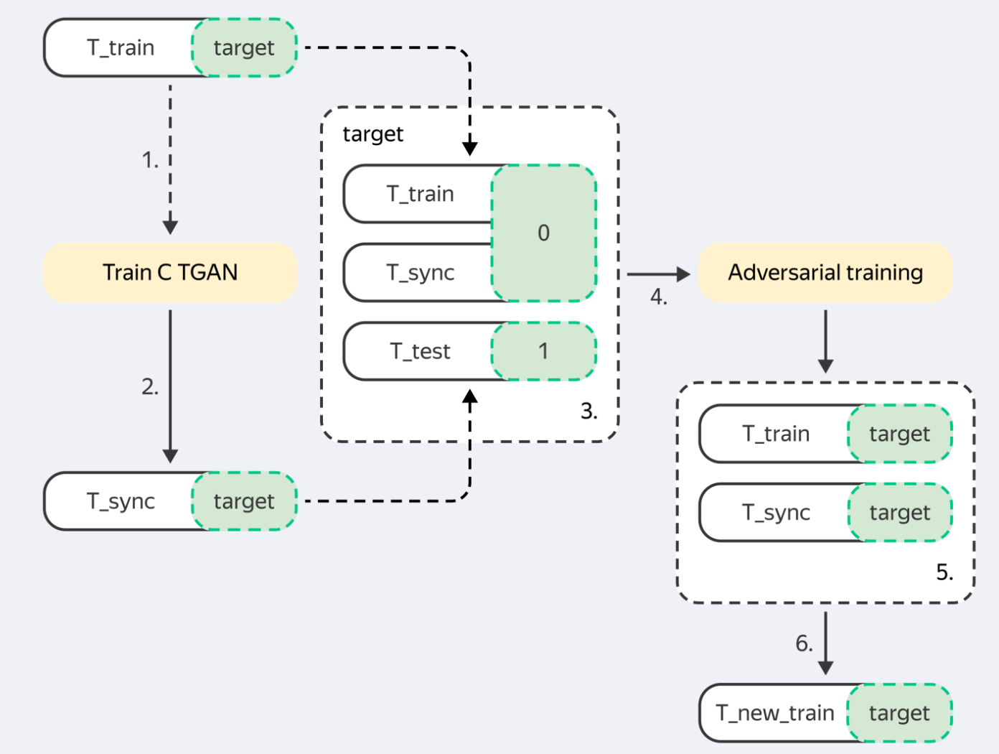

[](https://www.codefactor.io/repository/github/diyago/tabular-data-generation)
[](https://github.com/psf/black) [](https://opensource.org/licenses/Apache-2.0)
[](https://pepy.tech/project/tabgan)

# GANs and TimeGANs, Diffusions, LLM for tabular  data


Generative Networks are well-known for their success in realistic image generation. However, they can also be applied to generate tabular data. This library introduces major improvements for generating high-fidelity tabular data by offering a diverse suite of cutting-edge models, including Generative Adversarial Networks (GANs), specialized TimeGANs for time-series data, Denoising Diffusion Probabilistic Models (DDPM), and Large Language Model (LLM) based approaches. These enhancements allow for robust data generation across various dataset complexities and distributions, giving an opportunity to try GANs, TimeGANs, Diffusions, and LLMs for tabular data generation.
* Arxiv article: ["Tabular GANs for uneven distribution"](https://arxiv.org/abs/2010.00638)
* Medium post: GANs for tabular data [link broken]

## How to use library

* Installation: `pip install tabgan`
* To generate new data to train by sampling and then filtering by adversarial training
  call `GANGenerator().generate_data_pipe`.

### Data Format

TabGAN accepts data as a `numpy.ndarray` or `pandas.DataFrame` with columns categorized as:

*   **Continuous Columns**: Numerical columns with any possible value.
*   **Discrete Columns**: Columns with a limited set of values (e.g., categorical data).

Note: TabGAN does not differentiate between floats and integers, so all values are treated as floats. For integer requirements, round the output outside of TabGAN.

### Sampler Parameters

All samplers (`OriginalGenerator`, `GANGenerator`, `ForestDiffusionGenerator`, `LLMGenerator`) share the following input parameters:

*   **gen_x_times**: `float` (default: `1.1`) - How much data to generate. The output might be less due to postprocessing and adversarial filtering.
*   **cat_cols**: `list` (default: `None`) - A list of column names to be treated as categorical.
*   **bot_filter_quantile**: `float` (default: `0.001`) - The bottom quantile for postprocess filtering. Values below this quantile will be filtered out.
*   **top_filter_quantile**: `float` (default: `0.999`) - The top quantile for postprocess filtering. Values above this quantile will be filtered out.
*   **is_post_process**: `bool` (default: `True`) - Whether to perform post-filtering. If `False`, `bot_filter_quantile` and `top_filter_quantile` are ignored.
*   **adversarial_model_params**: `dict` (default: see below) - Parameters for the adversarial filtering model. Default values are optimized for binary classification tasks.
    ```python
    {
        "metrics": "AUC", "max_depth": 2, "max_bin": 100,
        "learning_rate": 0.02, "random_state": 42, "n_estimators": 100,
    }
    ```
*   **pregeneration_frac**: `float` (default: `2`) - For the generation step, `gen_x_times * pregeneration_frac` amount of data will be generated. However, after postprocessing, the aim is to return an amount of data equivalent to `(1 + gen_x_times)` times the size of the original dataset (if `only_generated_data` is `False`, otherwise `gen_x_times` times the size of the original dataset).
*   **only_generated_data**: `bool` (default: `False`) - If `True`, only the newly generated data is returned, without concatenating the input training dataframe.
*   **gen_params**: `dict` (default: see below) - Parameters for the underlying generative model training. Specific to `GANGenerator` and `LLMGenerator`.
    *   For `GANGenerator`:
        ```python
        {"batch_size": 500, "patience": 25, "epochs" : 500}
        ```
    *   For `LLMGenerator`:
        ```python
        {"batch_size": 32, "epochs": 4, "llm": "distilgpt2", "max_length": 500}
        ```

The available samplers are:
1.  **`GANGenerator`**: Utilizes the Conditional Tabular GAN (CTGAN) architecture, known for effectively modeling tabular data distributions and handling mixed data types (continuous and discrete). It learns the data distribution and generates synthetic samples that mimic the original data.
2.  **`ForestDiffusionGenerator`**: Implements a novel approach using diffusion models guided by tree-based methods (Forest Diffusion). This technique is capable of generating high-quality synthetic data, particularly for complex tabular structures, by gradually adding noise to data and then learning to reverse the process.
3.  **`LLMGenerator`**: Leverages Large Language Models (LLMs) using the GReaT (Generative Realistic Tabular data) framework. It transforms tabular data into a text format, fine-tunes an LLM on this representation, and then uses the LLM to generate new tabular instances by sampling from it. This approach is particularly promising for capturing complex dependencies and can generate diverse synthetic data.
4.  **`OriginalGenerator`**: Acts as a baseline sampler. It typically returns the original training data or a direct sample from it. This is useful for comparison purposes to evaluate the effectiveness of more complex generative models.


### `generate_data_pipe` Method Parameters

The `generate_data_pipe` method, available for all samplers, uses the following parameters:

*   **train_df**: `pd.DataFrame` - The training dataframe (features only, without the target variable).
*   **target**: `pd.DataFrame` - The input target variable for the training dataset.
*   **test_df**: `pd.DataFrame` - The test dataframe. The newly generated training dataframe should be statistically similar to this.
*   **deep_copy**: `bool` (default: `True`) - Whether to make a copy of the input dataframes. If `False`, input dataframes will be modified in place.
*   **only_adversarial**: `bool` (default: `False`) - If `True`, only adversarial filtering will be performed on the training dataframe; no new data will be generated.
*   **use_adversarial**: `bool` (default: `True`) - Whether to perform adversarial filtering.
*   **@return**: `Tuple[pd.DataFrame, pd.DataFrame]` - A tuple containing the newly generated/processed training dataframe and the corresponding target.


### Example Code

```python
from tabgan.sampler import OriginalGenerator, GANGenerator, ForestDiffusionGenerator, LLMGenerator
import pandas as pd
import numpy as np


# random input data
train = pd.DataFrame(np.random.randint(-10, 150, size=(150, 4)), columns=list("ABCD"))
target = pd.DataFrame(np.random.randint(0, 2, size=(150, 1)), columns=list("Y"))
test = pd.DataFrame(np.random.randint(0, 100, size=(100, 4)), columns=list("ABCD"))

# generate data
new_train1, new_target1 = OriginalGenerator().generate_data_pipe(train, target, test, )
new_train2, new_target2 = GANGenerator(gen_params={"batch_size": 500, "epochs": 10, "patience": 5 }).generate_data_pipe(train, target, test, )
new_train3, new_target3 = ForestDiffusionGenerator().generate_data_pipe(train, target, test, )
new_train4, new_target4 = LLMGenerator(gen_params={"batch_size": 32, 
                                                          "epochs": 4, "llm": "distilgpt2", "max_length": 500}).generate_data_pipe(train, target, test, )

# example with all params defined
new_train_gan_all_params, new_target_gan_all_params = GANGenerator(
    gen_x_times=1.1,
    cat_cols=None,
    bot_filter_quantile=0.001,
    top_filter_quantile=0.999,
    is_post_process=True,
    adversarial_model_params={
        "metrics": "AUC", "max_depth": 2, "max_bin": 100,
        "learning_rate": 0.02, "random_state": 42, "n_estimators": 100,
    },
    pregeneration_frac=2,
    only_generated_data=False,
    gen_params={"batch_size": 500, "patience": 25, "epochs": 500}
).generate_data_pipe(
    train, target, test,
    deep_copy=True,
    only_adversarial=False,
    use_adversarial=True
)

```

Thus, you may use this library to improve your dataset quality:

``` python
def fit_predict(clf, X_train, y_train, X_test, y_test):
    clf.fit(X_train, y_train)
    return sklearn.metrics.roc_auc_score(y_test, clf.predict_proba(X_test)[:, 1])


dataset = sklearn.datasets.load_breast_cancer()
clf = sklearn.ensemble.RandomForestClassifier(n_estimators=25, max_depth=6)
X_train, X_test, y_train, y_test = sklearn.model_selection.train_test_split(
    pd.DataFrame(dataset.data), pd.DataFrame(dataset.target, columns=["target"]), test_size=0.33, random_state=42)
print("initial metric", fit_predict(clf, X_train, y_train, X_test, y_test))

new_train1, new_target1 = OriginalGenerator().generate_data_pipe(X_train, y_train, X_test, )
print("OriginalGenerator metric", fit_predict(clf, new_train1, new_target1, X_test, y_test))

new_train1, new_target1 = GANGenerator().generate_data_pipe(X_train, y_train, X_test, )
print("GANGenerator metric", fit_predict(clf, new_train2, new_target2, X_test, y_test)) # Corrected variable name
```

### Advanced Usage: Generating Time-Series Data with TimeGAN

You can easily adjust the code to generate multidimensional time-series data. This approach primarily involves extracting day, month, and year components from a date column to be used as features in the generation process. Below is a demonstration:

```python
import pandas as pd
import numpy as np
from tabgan.utils import get_year_mnth_dt_from_date,make_two_digit,collect_dates
from tabgan.sampler import OriginalGenerator, GANGenerator


train_size = 100
train = pd.DataFrame(
        np.random.randint(-10, 150, size=(train_size, 4)), columns=list("ABCD")
    )
min_date = pd.to_datetime('2019-01-01')
max_date = pd.to_datetime('2021-12-31')
d = (max_date - min_date).days + 1

train['Date'] = min_date + pd.to_timedelta(np.random.randint(d, size=train_size), unit='d')
train = get_year_mnth_dt_from_date(train, 'Date')

new_train, new_target = GANGenerator(gen_x_times=1.1, cat_cols=['year'], bot_filter_quantile=0.001,
                                     top_filter_quantile=0.999,
                                     is_post_process=True, pregeneration_frac=2, only_generated_data=False).\
                                     generate_data_pipe(train.drop('Date', axis=1), None,
                                                        train.drop('Date', axis=1)
                                                                    )
new_train = collect_dates(new_train)
```

## Experiments
### Datasets and experiment design

**Check for data generation quality**
Just use built-in function
```
compare_dataframes(original_df, generated_df) # return between 0 and 1
```
**Running experiment**

To run experiment follow these steps:

1. Clone the repository. All required datasets are stored in `./Research/data` folder.
2. Install requirements: `pip install -r requirements.txt`
3. Run experiments using `python ./Research/run_experiment.py`. You may
   add more datasets, adjust validation type, and categorical encoders.
4. Observe metrics across all experiments in the console or in `./Research/results/fit_predict_scores.txt`.


**Experiment design**



**Picture 1.1** Experiment design and workflow

## Results
The table below (Table 1.2) shows ROC AUC scores for different sampling strategies. To facilitate comparison across datasets with potentially different baseline AUC scores, the ROC AUC scores for each dataset were scaled using min-max normalization (where the maximum score achieved by any method on that dataset becomes 1, and the minimum becomes 0). These scaled scores were then averaged across all datasets for each sampling strategy. Therefore, a higher value in the table indicates better relative performance in generating data that is difficult for a classifier to distinguish from the original data, when compared to other methods on the same set of datasets.

**Table 1.2** Averaged Min-Max Scaled ROC AUC scores for different sampling strategies across datasets. Higher is better (closer to 1 indicates performance similar to the best method on each dataset).

| dataset_name  |   None |   gan |   sample_original |
|:-----------------------|-------------------:|------------------:|------------------------------:|
| credit                 |           0.997 |          **0.998** |                      0.997 |
| employee               |           **0.986** |          0.966 |                      0.972 |
| mortgages              |           0.984 |          0.964 |                      **0.988** |
| poverty_A              |           0.937 |          **0.950** |                      0.933 |
| taxi                   |           0.966 |          0.938 |                      **0.987** |
| adult                  |           0.995 |          0.967 |                      **0.998** |

## Citation

If you use **tabgan** in a scientific publication, we would appreciate references to the following BibTex entry:
arxiv publication:
```bibtex
@misc{ashrapov2020tabular,
      title={Tabular GANs for uneven distribution}, 
      author={Insaf Ashrapov},
      year={2020},
      eprint={2010.00638},
      archivePrefix={arXiv},
      primaryClass={cs.LG}
}
```

## References

[1] Xu, L., & Veeramachaneni, K. (2018). *Synthesizing Tabular Data using Generative Adversarial Networks*. arXiv:1811.11264 [cs.LG].

[2] Jolicoeur-Martineau, A., Fatras, K., & Kachman, T. (2023). *Generating and Imputing Tabular Data via Diffusion and Flow-based Gradient-Boosted Trees*. Retrieved from https://github.com/SamsungSAILMontreal/ForestDiffusion.

[3] Xu, L., Skoularidou, M., Cuesta-Infante, A., & Veeramachaneni, K. (2019). *Modeling Tabular data using Conditional GAN*. NeurIPS.

[4] Borisov, V., Sessler, K., Leemann, T., Pawelczyk, M., & Kasneci, G. (2023). *Language Models are Realistic Tabular Data Generators*. ICLR.
