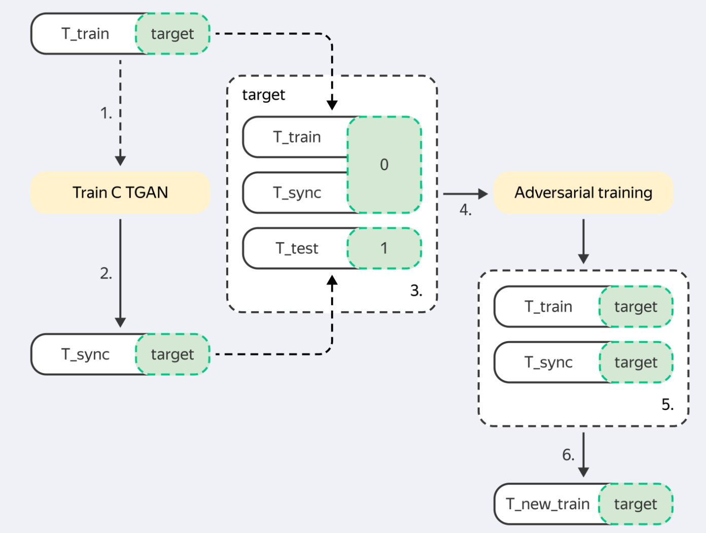

<p align="center">
  
</p>

<h1 align="center">TabGAN</h1>
<p align="center"><strong>High-quality synthetic tabular data generation</strong></p>

<p align="center">
  <a href="https://pypi.org/project/tabgan/"></a>
  <a href="https://pypi.org/project/tabgan/"></a>
  <a href="https://pepy.tech/project/tabgan"></a>
  <a href="https://opensource.org/licenses/Apache-2.0"></a>
  <a href="https://github.com/psf/black"></a>
  <a href="https://www.codefactor.io/repository/github/diyago/tabular-data-generation"></a>
  <a href="https://github.com/diyago/Tabular-data-generation/actions/workflows/codeql.yml"></a>
</p>

---

## Overview

TabGAN provides a unified Python interface for generating synthetic tabular data using multiple state-of-the-art generative approaches:

| Approach | Backend | Strengths |
|----------|---------|-----------|
| **GANs** | Conditional Tabular GAN (CTGAN) | Mixed data types, complex multivariate distributions |
| **Diffusion Models** | ForestDiffusion (tree-based gradient boosting) | High-fidelity generation for structured data |
| **Large Language Models** | GReaT framework | Capturing semantic dependencies, conditional text generation |
| **Baseline** | Random sampling with replacement | Quick benchmarking and comparison |

All generators share a common pipeline: **generate &rarr; post-process &rarr; adversarial filter**, ensuring synthetic data stays close to the real data distribution.

*Based on the paper: [Tabular GANs for uneven distribution](https://arxiv.org/abs/2010.00638) (arXiv:2010.00638)*

## Key Features

- **Unified API** &mdash; switch between GANs, diffusion models, and LLMs with a single parameter change
- **Adversarial filtering** &mdash; built-in LightGBM-based validation keeps synthetic samples distribution-consistent
- **Mixed data types** &mdash; native handling of continuous, categorical, and free-text columns
- **Conditional generation** &mdash; generate text conditioned on categorical attributes via LLM prompting
- **LLM API support** &mdash; integrate with LM Studio, OpenAI, Ollama, or any OpenAI-compatible endpoint
- **Quality validation** &mdash; compare original and synthetic distributions with a single function call

## Installation

```bash
pip install tabgan
```

## Quick Start

```python
import pandas as pd
import numpy as np
from tabgan.sampler import GANGenerator

train = pd.DataFrame(np.random.randint(-10, 150, size=(150, 4)), columns=list("ABCD"))
target = pd.DataFrame(np.random.randint(0, 2, size=(150, 1)), columns=list("Y"))
test = pd.DataFrame(np.random.randint(0, 100, size=(100, 4)), columns=list("ABCD"))

new_train, new_target = GANGenerator().generate_data_pipe(train, target, test)
```

## Available Generators

| Generator | Description | Best For |
|-----------|-------------|----------|
| `GANGenerator` | CTGAN-based generation | General tabular data with mixed types |
| `ForestDiffusionGenerator` | Diffusion models with tree-based methods | Complex tabular structures |
| `LLMGenerator` | Large Language Model based | Semantic dependencies, text columns |
| `OriginalGenerator` | Baseline random sampler | Benchmarking and comparison |

## API Reference

### Common Parameters

All generators accept the following parameters:

| Parameter | Type | Default | Description |
|-----------|------|---------|-------------|
| `gen_x_times` | `float` | `1.1` | Multiplier for synthetic sample count relative to training size |
| `cat_cols` | `list` | `None` | Column names to treat as categorical |
| `bot_filter_quantile` | `float` | `0.001` | Lower quantile for post-processing filters |
| `top_filter_quantile` | `float` | `0.999` | Upper quantile for post-processing filters |
| `is_post_process` | `bool` | `True` | Enable quantile-based post-filtering |
| `pregeneration_frac` | `float` | `2` | Oversampling factor before filtering |
| `only_generated_data` | `bool` | `False` | Return only synthetic rows (exclude originals) |
| `gen_params` | `dict` | See below | Generator-specific hyperparameters |

### Generator-Specific Parameters (`gen_params`)

**GANGenerator:**
```python
{"batch_size": 500, "patience": 25, "epochs": 500}
```

**LLMGenerator:**
```python
{"batch_size": 32, "epochs": 4, "llm": "distilgpt2", "max_length": 500}
```

### `generate_data_pipe` Method

```python
new_train, new_target = generator.generate_data_pipe(
    train_df,           # pd.DataFrame - training features
    target,             # pd.DataFrame - target variable (or None)
    test_df,            # pd.DataFrame - test features for distribution alignment
    deep_copy=True,     # bool - copy input DataFrames
    only_adversarial=False,  # bool - skip generation, only filter
    use_adversarial=True,    # bool - enable adversarial filtering
)
```

**Returns:** `Tuple[pd.DataFrame, pd.DataFrame]` &mdash; `(new_train, new_target)`

## Data Format

TabGAN accepts `pandas.DataFrame` inputs with:

- **Continuous columns** &mdash; any real-valued numerical data
- **Categorical columns** &mdash; discrete columns with a finite set of values

> **Note:** TabGAN processes values as floating-point internally. Apply rounding after generation for integer-valued outputs.

## Examples

### Basic Usage with All Generators

```python
from tabgan.sampler import OriginalGenerator, GANGenerator, ForestDiffusionGenerator, LLMGenerator
import pandas as pd
import numpy as np

train = pd.DataFrame(np.random.randint(-10, 150, size=(150, 4)), columns=list("ABCD"))
target = pd.DataFrame(np.random.randint(0, 2, size=(150, 1)), columns=list("Y"))
test = pd.DataFrame(np.random.randint(0, 100, size=(100, 4)), columns=list("ABCD"))

new_train1, new_target1 = OriginalGenerator().generate_data_pipe(train, target, test)
new_train2, new_target2 = GANGenerator(
    gen_params={"batch_size": 500, "epochs": 10, "patience": 5}
).generate_data_pipe(train, target, test)
new_train3, new_target3 = ForestDiffusionGenerator().generate_data_pipe(train, target, test)
new_train4, new_target4 = LLMGenerator(
    gen_params={"batch_size": 32, "epochs": 4, "llm": "distilgpt2", "max_length": 500}
).generate_data_pipe(train, target, test)
```

### Full Parameter Example

```python
new_train, new_target = GANGenerator(
    gen_x_times=1.1,
    cat_cols=None,
    bot_filter_quantile=0.001,
    top_filter_quantile=0.999,
    is_post_process=True,
    adversarial_model_params={
        "metrics": "AUC", "max_depth": 2, "max_bin": 100,
        "learning_rate": 0.02, "random_state": 42, "n_estimators": 100,
    },
    pregeneration_frac=2,
    only_generated_data=False,
    gen_params={"batch_size": 500, "patience": 25, "epochs": 500},
).generate_data_pipe(
    train, target, test,
    deep_copy=True,
    only_adversarial=False,
    use_adversarial=True,
)
```

### LLM Conditional Text Generation

Generate synthetic rows with novel text values conditioned on categorical attributes:

```python
import pandas as pd
from tabgan.sampler import LLMGenerator

train = pd.DataFrame({
    "Name": ["Anna", "Maria", "Ivan", "Sergey", "Olga", "Boris"],
    "Gender": ["F", "F", "M", "M", "F", "M"],
    "Age": [25, 30, 35, 40, 28, 32],
    "Occupation": ["Engineer", "Doctor", "Artist", "Teacher", "Manager", "Pilot"],
})

new_train, _ = LLMGenerator(
    gen_x_times=1.5,
    text_generating_columns=["Name"],      # columns to generate novel text for
    conditional_columns=["Gender"],         # columns that condition text generation
    gen_params={"batch_size": 32, "epochs": 4, "llm": "distilgpt2", "max_length": 500},
    is_post_process=False,
).generate_data_pipe(train, target=None, test_df=None, only_generated_data=True)
```

**How it works:**
1. Sample conditional column values from their empirical distributions
2. Impute remaining non-text columns using the fitted GReaT model
3. Generate novel text via prompt-based generation
4. Ensure generated text values differ from the original data

### LLM API-Based Text Generation

Use external LLM APIs (LM Studio, OpenAI, Ollama) instead of local models:

```python
import pandas as pd
from tabgan.sampler import LLMGenerator
from tabgan.llm_config import LLMAPIConfig

train = pd.DataFrame({
    "Name": ["Anna", "Maria", "Ivan", "Sergey", "Olga", "Boris"],
    "Gender": ["F", "F", "M", "M", "F", "M"],
    "Age": [25, 30, 35, 40, 28, 32],
    "Occupation": ["Engineer", "Doctor", "Artist", "Teacher", "Manager", "Pilot"],
})

# LM Studio
api_config = LLMAPIConfig.from_lm_studio(
    base_url="http://localhost:1234",
    model="google/gemma-3-12b",
    timeout=90,
)

# Or OpenAI:  LLMAPIConfig.from_openai(api_key="...", model="gpt-4")
# Or Ollama:  LLMAPIConfig.from_ollama(model="llama3")

new_train, _ = LLMGenerator(
    gen_x_times=1.5,
    text_generating_columns=["Name"],
    conditional_columns=["Gender"],
    gen_params={"batch_size": 32, "epochs": 4, "llm": "distilgpt2", "max_length": 500},
    llm_api_config=api_config,
    is_post_process=False,
).generate_data_pipe(train, target=None, test_df=None, only_generated_data=True)
```

<details>
<summary><strong>LLM API Configuration Options</strong></summary>

| Parameter | Type | Default | Description |
|-----------|------|---------|-------------|
| `base_url` | `str` | `"http://localhost:1234"` | API server base URL |
| `model` | `str` | `"google/gemma-3-12b"` | Model identifier |
| `api_key` | `str` | `None` | API key for authentication |
| `timeout` | `int` | `90` | Request timeout in seconds |
| `max_tokens` | `int` | `256` | Maximum tokens to generate |
| `temperature` | `float` | `0.7` | Sampling temperature |
| `system_prompt` | `str` | `None` | System prompt for generation |

**Testing the connection:**

```python
from tabgan.llm_config import LLMAPIConfig
from tabgan.llm_api_client import LLMAPIClient

config = LLMAPIConfig.from_lm_studio()
with LLMAPIClient(config) as client:
    print(f"API available: {client.check_connection()}")
    print(f"Generated: {client.generate('Generate a female name: ')}")
```

</details>

### Improving Model Performance

```python
import sklearn
import pandas as pd
from tabgan.sampler import GANGenerator

def evaluate(clf, X_train, y_train, X_test, y_test):
    clf.fit(X_train, y_train)
    return sklearn.metrics.roc_auc_score(y_test, clf.predict_proba(X_test)[:, 1])

dataset = sklearn.datasets.load_breast_cancer()
clf = sklearn.ensemble.RandomForestClassifier(n_estimators=25, max_depth=6)
X_train, X_test, y_train, y_test = sklearn.model_selection.train_test_split(
    pd.DataFrame(dataset.data),
    pd.DataFrame(dataset.target, columns=["target"]),
    test_size=0.33, random_state=42,
)

print("Baseline:", evaluate(clf, X_train, y_train, X_test, y_test))

new_train, new_target = GANGenerator().generate_data_pipe(X_train, y_train, X_test)
print("With GAN:", evaluate(clf, new_train, new_target, X_test, y_test))
```

### Time-Series Data Generation

```python
import pandas as pd
import numpy as np
from tabgan.utils import get_year_mnth_dt_from_date, collect_dates
from tabgan.sampler import GANGenerator

train = pd.DataFrame(np.random.randint(-10, 150, size=(100, 4)), columns=list("ABCD"))
min_date, max_date = pd.to_datetime("2019-01-01"), pd.to_datetime("2021-12-31")
d = (max_date - min_date).days + 1
train["Date"] = min_date + pd.to_timedelta(np.random.randint(d, size=100), unit="d")
train = get_year_mnth_dt_from_date(train, "Date")

new_train, _ = GANGenerator(
    gen_x_times=1.1, cat_cols=["year"],
    bot_filter_quantile=0.001, top_filter_quantile=0.999,
    is_post_process=True, pregeneration_frac=2,
).generate_data_pipe(train.drop("Date", axis=1), None, train.drop("Date", axis=1))

new_train = collect_dates(new_train)
```

## Quality Report

Generate a self-contained HTML report comparing original and synthetic data across multiple quality axes: column statistics, PSI, correlation heatmaps, distribution plots, and ML utility (TSTR vs TRTR).

```python
from tabgan import QualityReport

report = QualityReport(
    original_df, synthetic_df,
    cat_cols=["gender"],
    target_col="target",      # enables ML utility evaluation
).compute()

# Export to a single HTML file (charts embedded as base64)
report.to_html("quality_report.html")

# Or access metrics programmatically
summary = report.summary()
print(f"Overall score: {summary['overall_score']}")
print(f"Mean PSI: {summary['psi']['mean']}")
print(f"ML utility ratio: {summary['ml_utility']['utility_ratio']}")
```

For a quick comparison without the full report:

```python
from tabgan.utils import compare_dataframes

score = compare_dataframes(original_df, generated_df)  # 0.0 (poor) to 1.0 (excellent)
```

## Constraints

Enforce business rules on generated data. Constraints are applied as a post-generation step — invalid rows are repaired or filtered out.

```python
from tabgan import GANGenerator, RangeConstraint, UniqueConstraint, FormulaConstraint, RegexConstraint

new_train, new_target = GANGenerator(gen_x_times=1.5).generate_data_pipe(
    train, target, test,
    constraints=[
        RangeConstraint("age", min_val=0, max_val=120),
        UniqueConstraint("email"),
        FormulaConstraint("end_date > start_date"),
        RegexConstraint("zip_code", r"\d{5}"),
    ],
)
```

**Available constraints:**

| Constraint | Description | Fix strategy |
|------------|-------------|--------------|
| `RangeConstraint` | Numeric values within `[min, max]` | Clips values to bounds |
| `UniqueConstraint` | No duplicate values in a column | Drops duplicate rows |
| `FormulaConstraint` | Boolean expression via `df.eval()` | Filters violating rows |
| `RegexConstraint` | String values match a regex pattern | Filters non-matching rows |

The `ConstraintEngine` supports two strategies: `"fix"` (repair then filter) and `"filter"` (drop violations only):

```python
from tabgan import ConstraintEngine, RangeConstraint

engine = ConstraintEngine(
    constraints=[RangeConstraint("price", min_val=0)],
    strategy="fix",  # or "filter"
)
cleaned_df = engine.apply(generated_df)
```

## Privacy Metrics

Assess re-identification risk of synthetic data before sharing. Includes Distance to Closest Record (DCR), Nearest Neighbor Distance Ratio (NNDR), and membership inference risk.

```python
from tabgan import PrivacyMetrics

pm = PrivacyMetrics(original_df, synthetic_df, cat_cols=["gender"])
summary = pm.summary()

print(f"Overall privacy score: {summary['overall_privacy_score']}")  # 0 (risky) to 1 (private)
print(f"DCR mean: {summary['dcr']['mean']}")
print(f"NNDR mean: {summary['nndr']['mean']}")
print(f"Membership inference AUC: {summary['membership_inference']['auc']}")  # closer to 0.5 = better
```

**Metrics explained:**

| Metric | What it measures | Good value |
|--------|-----------------|------------|
| **DCR** | Distance from each synthetic row to nearest real row | Higher = more private |
| **NNDR** | Ratio of 1st/2nd nearest neighbor distances | Closer to 1.0 |
| **MI AUC** | Can a classifier tell if a record was in training data? | Closer to 0.5 |

## sklearn Pipeline Integration

Use `TabGANTransformer` to insert synthetic data augmentation into an sklearn `Pipeline`:

```python
from sklearn.pipeline import Pipeline
from sklearn.ensemble import RandomForestClassifier
from tabgan import TabGANTransformer

pipe = Pipeline([
    ("augment", TabGANTransformer(gen_x_times=1.5, cat_cols=["gender"])),
    ("model", RandomForestClassifier()),
])

# fit() generates synthetic data and trains the model on augmented data
pipe.fit(X_train, y_train)
```

Works with any generator and supports constraints:

```python
from tabgan import TabGANTransformer, GANGenerator, RangeConstraint

transformer = TabGANTransformer(
    generator_class=GANGenerator,
    gen_x_times=2.0,
    gen_params={"batch_size": 500, "epochs": 10, "patience": 5},
    constraints=[RangeConstraint("age", min_val=0, max_val=120)],
)

X_augmented = transformer.fit_transform(X_train, y_train)
y_augmented = transformer.get_augmented_target()
```

## Command-Line Interface

```bash
tabgan-generate \
    --input-csv train.csv \
    --target-col target \
    --generator gan \
    --gen-x-times 1.5 \
    --cat-cols year,gender \
    --output-csv synthetic_train.csv
```

## Pipeline Architecture



```
Input (train_df, target, test_df)
  |
  v
[Preprocess] --> Validate DataFrames, prepare columns
  |
  v
[Generate]  --> CTGAN / ForestDiffusion / GReaT LLM / Random sampling
  |
  v
[Post-process] --> Quantile-based filtering against test distribution
  |
  v
[Adversarial Filter] --> LightGBM classifier removes dissimilar samples
  |
  v
Output (synthetic_df, synthetic_target)
```

## Benchmark Results

Normalized ROC AUC scores (higher is better):

| Dataset | No augmentation | GAN | Sample Original |
|---------|:-:|:-:|:-:|
| credit | 0.997 | **0.998** | 0.997 |
| employee | **0.986** | 0.966 | 0.972 |
| mortgages | 0.984 | 0.964 | **0.988** |
| poverty_A | 0.937 | **0.950** | 0.933 |
| taxi | 0.966 | 0.938 | **0.987** |
| adult | 0.995 | 0.967 | **0.998** |

## Citation

```bibtex
@misc{ashrapov2020tabular,
    title={Tabular GANs for uneven distribution},
    author={Insaf Ashrapov},
    year={2020},
    eprint={2010.00638},
    archivePrefix={arXiv},
    primaryClass={cs.LG}
}
```

## References

1. Xu, L., & Veeramachaneni, K. (2018). *Synthesizing Tabular Data using Generative Adversarial Networks*. arXiv:1811.11264.
2. Jolicoeur-Martineau, A., Fatras, K., & Kachman, T. (2023). *Generating and Imputing Tabular Data via Diffusion and Flow-based Gradient-Boosted Trees*. SamsungSAILMontreal/ForestDiffusion.
3. Xu, L., Skoularidou, M., Cuesta-Infante, A., & Veeramachaneni, K. (2019). *Modeling Tabular data using Conditional GAN*. NeurIPS.
4. Borisov, V., Sessler, K., Leemann, T., Pawelczyk, M., & Kasneci, G. (2023). *Language Models are Realistic Tabular Data Generators*. ICLR.

## License

Apache License 2.0 &mdash; see [LICENSE](LICENSE) for details.
